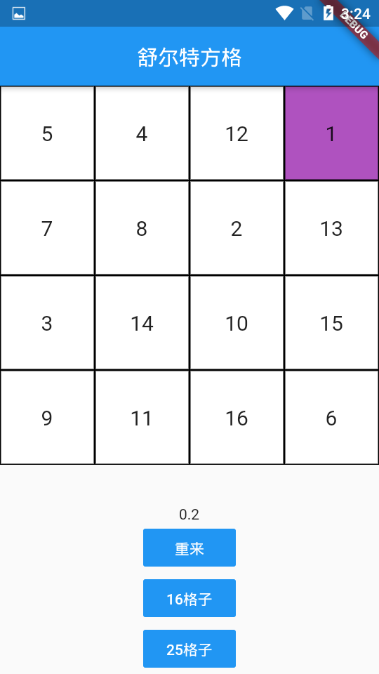
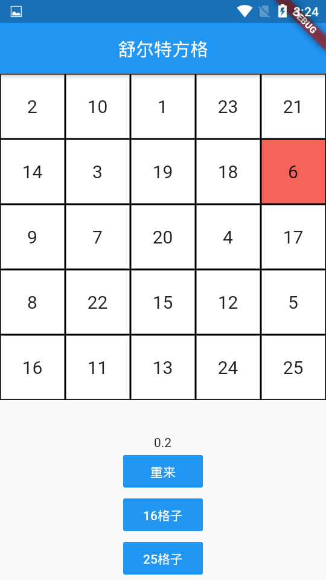
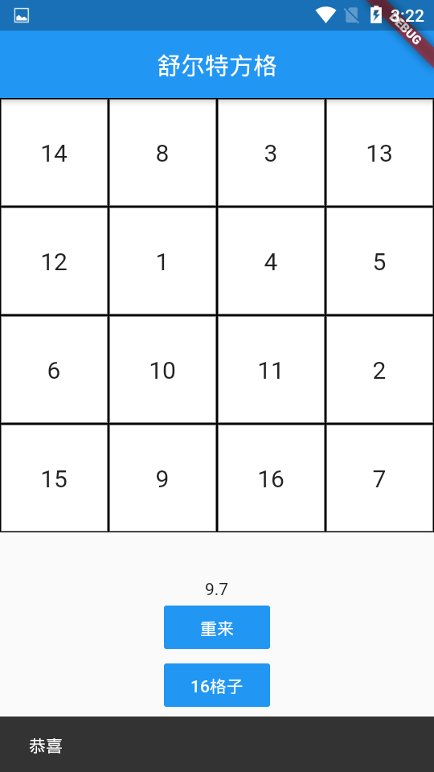

# schulte_grid

A new Flutter project.

## Getting Started

This project is a starting point for a Flutter application.

A few resources to get you started if this is your first Flutter project:

- [Lab: Write your first Flutter app](https://flutter.dev/docs/get-started/codelab)
- [Cookbook: Useful Flutter samples](https://flutter.dev/docs/cookbook)

For help getting started with Flutter, view our
[online documentation](https://flutter.dev/docs), which offers tutorials,
samples, guidance on mobile development, and a full API reference.

## 舒尔特方格

### 16格或25格的舒尔特方格，主要使用GridView.count建立方格、Timer计时、ColorTween颜色动画。

###  主要内容来自马友发的B站视频[【无聊的编码】用Flutter让孩子“戒”掉打游戏，舒尔特方格是个什么鬼？？？](https://www.bilibili.com/video/av68344452)，动画改用SingleTickerProviderStateMixin，使用单个controller实现。

### 效果图

